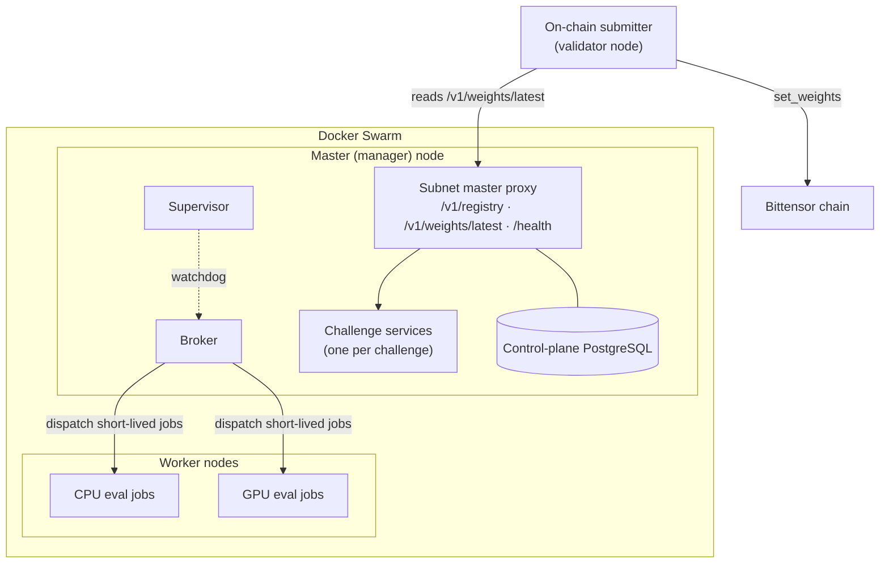

BaseIntelligence is a **multi-challenge Bittensor subnet** (netuid `100`). Independent
challenges run under one validator network: the subnet routes miner traffic to the
right challenge, collects each challenge's raw hotkey weights, normalizes emissions,
maps miner hotkeys to Bittensor UIDs, and publishes a final weight vector for
validators to submit on-chain.

_Source: `README.md:21-36`; `src/platform_network/config/settings.py:12`._

<Card title="Source repository" icon="github" href="https://github.com/BaseIntelligence/base">
  The subnet orchestration layer — master proxy, broker, supervisor, weight
  aggregation, and the Docker Swarm deployment path.
</Card>

## The shape of the system

The subnet runs as a **single Docker Swarm**. One **master (manager) node** hosts
the control plane and every long-lived challenge service; manually enrolled
**worker nodes** run only short-lived CPU/GPU evaluation jobs. There is no
Kubernetes and no `runtime.backend` selector — the only backend is Swarm.

_Source: `README.md:32-36`; `docs/architecture.md:36-40`, `docs/architecture.md:67`._

## Components

| Component | Where it runs | Responsibility |
|-----------|---------------|----------------|
| Subnet master proxy | Manager node | Single public API on one port: `/v1/registry`, `/v1/weights/latest`, `/health`, `/challenges/*` passthrough, and token-gated admin |
| Broker | Manager node | Dispatches short-lived CPU/GPU evaluation jobs to workers as Swarm replicated-jobs |
| Supervisor | Manager node | systemd watchdog running the broker-health, timeout-reaper, image-updater, config-sync, and self-update loops |
| Challenge services | Manager node | Long-lived challenge APIs, one isolated service per challenge |
| Control-plane PostgreSQL | Manager node | Shared master/validator state, private to the control-plane process |
| CPU / GPU jobs | Worker nodes | Short-lived evaluation work, dispatched by the broker |
| On-chain submitter | Validator node | Reads the master's final vector and submits it to Bittensor |

_Source: `docs/architecture.md:36-55`; `README.md:32-36`, `README.md:262-264`._

The master proxy is created by `create_proxy_app`; when an operator wires a runtime
controller into it, the admin/registry router is mounted onto the **same** app, so
the registry, weights, health, passthrough, and admin routes are all served on one
port.

_Source: `src/platform_network/master/app_proxy.py:263`, `src/platform_network/master/app_proxy.py:534-548`; `src/platform_network/master/app_admin.py:66`._

## The epoch weight flow

At each epoch the master collects raw challenge weights, normalizes emissions, maps
miner hotkeys to Bittensor UIDs, and publishes a vector that the on-chain submitter
posts to the chain:

1. The master tracks active challenges and their emission shares.
2. Each challenge calculates raw hotkey weights from its own scoring rules.
3. The master normalizes challenge outputs, applies configured emissions, and maps
   hotkeys to UIDs.
4. The on-chain submitter fetches the master's final vector and submits weights to
   Bittensor at epoch boundaries.

_Source: `README.md:127-135`; `src/platform_network/master/service.py:85-139`._

The full, line-by-line pipeline — including how raw scores are cleaned, how
emissions are combined, and how UID `0` is excluded — is documented on the
[Weights pipeline](/architecture/weights-pipeline) page.

## Trust boundaries

Each challenge is isolated: its own repository and OCI image, an internal shared
token, public routes behind the proxy, an encrypted overlay network, and its own
`/data` Swarm volume for SQLite state. The shared control-plane PostgreSQL is
private to the master process and is never injected into a challenge.

_Source: `docs/architecture.md:57-61`; `docs/security.md:7-9`._

The [Security model](/architecture/security) page covers authentication, signing,
secret handling, and validator trust in full.

## Where to go next

<CardGroup cols={2}>
  <Card title="Master node" icon="server" href="/architecture/master">
    The manager node, the single public API, and the control plane it owns.
  </Card>
  <Card title="Swarm and miner pool" icon="docker" href="/architecture/swarm">
    The Docker Swarm topology, overlay networks, and worker enrollment.
  </Card>
  <Card title="Weights pipeline" icon="scale-balanced" href="/architecture/weights-pipeline">
    Epoch collection, normalization, UID mapping, and on-chain submission.
  </Card>
  <Card title="Security model" icon="lock" href="/architecture/security">
    Isolation rules, auth, signing, secrets, and validator trust.
  </Card>
</CardGroup>

## Sources

All citations on this page reference the `base` repository (canonical), pinned at
SHA `e33109bfa4f5054928c3b4d429be9cf35d36b166` (see `SOURCES.md`), cloned at
`/projects/baseintelligence/sources/base`. Paths prefixed with `src/platform_network/`
are the internal Python package.
