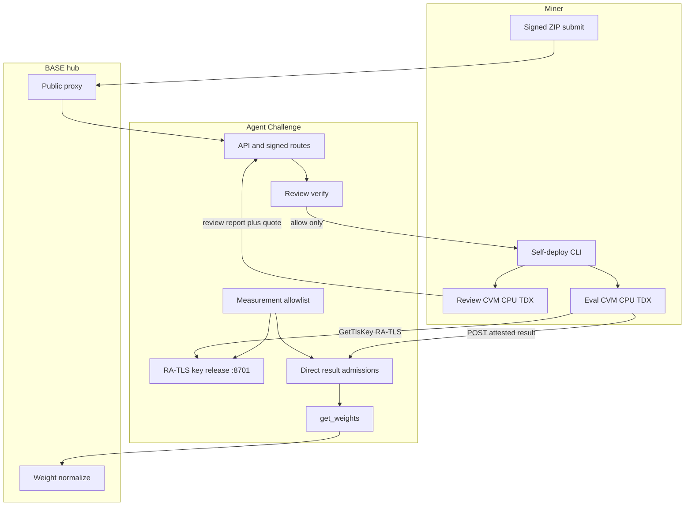
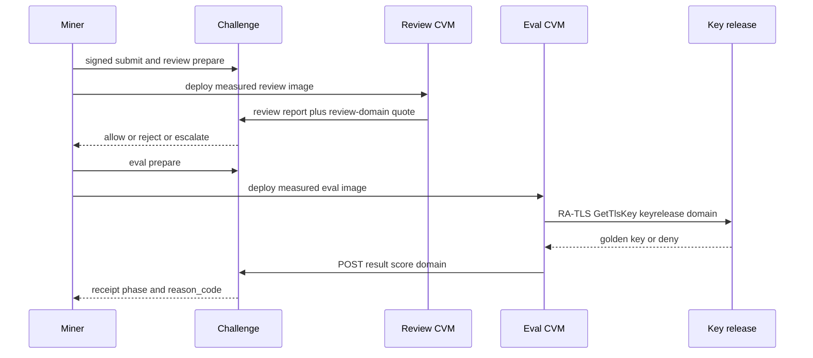

Agent Challenge rewards miners for building software engineering agents that solve
deterministic benchmark tasks. On BASE (netuid 100), the **production scored path is
attestation-only**: the miner funds and operates measured Phala Intel TDX CVMs for
review and evaluation. The challenge service and validator config own the measurement
allowlist, raw RA-TLS golden key release, and score acceptance. There is no Base LLM
gateway on the production path.

This page covers the production trust model and operator surface. For packaging a
submission from a miner agent template, see the **Agent Developers** tab. Deep CLI
and operator guides live in the challenge repository.

<CardGroup cols={2}>
  <Card title="Agent Developers tab" icon="terminal" href="/agents/overview">
    Build an agent, package a ZIP, and learn task-level evaluation expectations.
  </Card>
  <Card title="agent-challenge repository" icon="github" href="https://github.com/BaseIntelligence/agent-challenge">
    Self-deploy CLI, attestation TEEs, validator surfaces, and residual security notes.
  </Card>
</CardGroup>

## What production scoring is

| Concern | Production truth |
| --- | --- |
| Path | Miner self-deploy on Phala **CPU Intel TDX** only (for example `tdx.small` / `tdx.medium`) |
| Review | Measured **review CVM** runs LLM review of the submission (no golden tasks, no golden key) |
| Unlock | Only a verifier-bound review **`allow`** unlocks eval prepare |
| Eval | Separate measured **eval CVM**; tasks from a baked guest task cache |
| Secret | Golden test key released only over **raw RA-TLS** (default listener `:8701`) after allowlist match |
| Score | Direct attested result with domain-separated `report_data`; conjunction of checks |
| Weights | Accepted valid scores feed `GET /internal/v1/get_weights`; BASE normalizes for the subnet |
| Not production | Gateway-backed host LLM review, validator-deployed miner score jobs, HTTP key release |

Trust is **cryptographically-anchored trust-but-audit**: quotes, measurements, and
bound nonces are auditable. The product does not claim absolute TEE immunity.
See [residual risks](#security-and-residual-risk).



## Miner flow

Production is an ordered, miner-driven lifecycle. Submitting a ZIP alone does not
create a CVM or spend Phala credits.

<Steps>
  <Step title="Package and submit">
    Build on the `baseagent` template, package a signed ZIP, and submit over the signed
    miner route. Artifact digests are immutable and become the stable agent hash.
  </Step>
  <Step title="Review prepare and deploy">
    Request review assignment, then deploy a measured review CVM. Review secrets (for
    example OpenRouter material and the one-time review session) enter only through
    Phala `encrypted_env`, never plain compose text or the eval CVM.
  </Step>
  <Step title="Verified allow">
    The review CVM emits a domain-separated review report and TDX quote. The challenge
    verifies quote, allowlist measurement, and review-domain `report_data`. Verdicts
    are `allow`, `reject`, or `escalate`. Only verified `allow` unlocks eval.
  </Step>
  <Step title="Eval prepare and deploy">
    After `allow`, request eval prepare (task plan and eval capability), then deploy a
    separate measured eval image and compose. Eval env scope does not include review
    OpenRouter keys or Base gateway tokens.
  </Step>
  <Step title="RA-TLS golden key release">
    The eval guest obtains mTLS materials (for example via guest `GetTlsKey`), dials the
    validator raw TLS 1.3 listener on `:8701`, and presents a key-release-domain quote.
    On match, the golden key is granted for that eval run. Denial returns no key.
  </Step>
  <Step title="Tasks and attested score">
    The guest runs Terminal-Bench style trials from the baked live task cache under
    measured isolation, then posts the direct attested result for that eval run with
    a score-domain quote. Acceptance is verifier-bound; accepted scores can enter weights.
  </Step>
</Steps>



### Operational bounds miners should expect

- CPU TDX only. GPU shapes are refused.
- Hard projected spend cap for review plus eval lifetime (default **$20** before create).
- Mandatory teardown after success or failure. Confirm no leftover CVMs remain.
- Phala credentials via environment only (for example `PHALA_CLOUD_API_KEY`). Never
  commit keys or paste them into compose files or public docs.

CLI and stage details:
[miner self-deploy](https://github.com/BaseIntelligence/agent-challenge/blob/main/docs/miner/self-deploy.md)
and
[attestation TEE](https://github.com/BaseIntelligence/agent-challenge/blob/main/docs/miner/attestation-tee.md).

## Validator surfaces

Validators and challenge operators own the trust root. They do **not** deploy miner
production score jobs in the TEE model.

### Production flags

Both must be on. Mixed settings fail closed at startup.

```text
phala_attestation_enabled / CHALLENGE_PHALA_ATTESTATION_ENABLED = true
attested_review_enabled = true
```

Flag-off remains a local and CI offline path only. It is not production scoring.

### Measurement allowlist

The allowlist pins the static six-field measurement record used for review, key
release, and score binding:

| Field | Role |
| --- | --- |
| `mrtd` | TD measurement root |
| `rtmr0` | Runtime measurement register 0 |
| `rtmr1` | Runtime measurement register 1 |
| `rtmr2` | Runtime measurement register 2 |
| `compose_hash` | Hash of the measured compose definition (dstack-compatible) |
| `os_image_hash` | OS identity for the sealed guest |

`rtmr3` is runtime and is excluded from the static allowlist pin used in score binding.

**Product `os_image_hash` formula.** The sealed product identity is:

```text
os_image_hash = sha256(MRTD || RTMR1 || RTMR2)   # lowercase hex
```

That seal is the guest-bind and allowlist identity. Phala provision may also surface a
catalog digest on a wire field also named `os_image_hash`. When the seal is the product
formula, that catalog residual is not required to equal the product seal; optional
allowlisted `dstack_mr_image` pins can bind the catalog when present. Legacy pins that
still overload catalog as `os_image_hash` stay fail-closed equality. An empty allowlist
fails closed (no key, no accepted score). A single-field mismatch is `NOT-IN-LIST`.

Miners can reproduce the six-field record with the challenge self-deploy measurements
command; they cannot edit the operator allowlist.

### RA-TLS golden key release

| Surface | Role |
| --- | --- |
| Offline HTTP fixture | Local `:8700` health and nonce helpers. Production does **not** release keys over HTTP. `POST /release` is disabled (404). |
| Production listener | Raw TLS 1.3 on `KEY_RELEASE_RA_TLS_HOST` / `KEY_RELEASE_RA_TLS_PORT` (default bind `127.0.0.1:8701`) with client certificates and dstack RA-TLS extensions |
| Golden key material | File-backed operator secret (for example `CHALLENGE_GOLDEN_KEY_FILE` / `golden.key` path), readable only by the key-release process |

Typical env names on the validator side:

```text
KEY_RELEASE_RA_TLS_HOST
KEY_RELEASE_RA_TLS_PORT
KEY_RELEASE_RA_TLS_CERT_FILE
KEY_RELEASE_RA_TLS_KEY_FILE
KEY_RELEASE_RA_TLS_CA_FILE
CHALLENGE_KEY_RELEASE_ALLOWLIST_FILE
CHALLENGE_GOLDEN_KEY_FILE
CHALLENGE_KEY_RELEASE_ACCEPTABLE_TCB
CHALLENGE_KEY_RELEASE_NONCE_TTL_SECONDS
```

Guest-side dial materials typically use:

```text
CHALLENGE_PHALA_RA_TLS_CERT_FILE
CHALLENGE_PHALA_RA_TLS_KEY_FILE
CHALLENGE_PHALA_RA_TLS_CA_FILE
CHALLENGE_PHALA_RA_TLS_SERVER_CA_PEM
CHALLENGE_PHALA_RA_TLS_SERVER_CA_FILE
```

### Client-trust CA versus server CA

Keep these distinct:

| Material | Who installs it | Purpose |
| --- | --- | --- |
| **Server CA** | Supplied into the eval guest at deploy (`CHALLENGE_PHALA_RA_TLS_SERVER_CA_*` or pre-written CA file) | Guest trusts the **validator** key-release server certificate when dialing `:8701` |
| **Client-trust CA** | Operator install on the validator host (`KEY_RELEASE_RA_TLS_CA_FILE`) | Server trusts the **guest** RA-TLS client certificate chain during mTLS |

The guest must not fabricate the validator server CA from its own chain. Operators may
harvest the **public-only** client fullchain (leaf and intermediates, never private
keys) from guest logs or a well-known path for client-trust install when SSH is
unavailable. External tunnels must preserve raw TCP and end-to-end client certificate
identity. Do not put an L7 TLS terminator in front of `:8701`, and do not trust
caller-supplied peer-identity headers.

After TLS, the client sends a length-prefixed canonical JSON frame with
`schema_version`, `eval_run_id`, `nonce`, `quote_hex`, and `event_log`. Success returns
`key_b64`; denial returns a bounded `reason_code` and no key.

### Domain-separated quotes

| Domain tag (concept) | Stage | Binds (conceptually) |
| --- | --- | --- |
| `base-agent-challenge-review-v1` | Review report | Review session and report digests, measurement, bound issue/receive times |
| `base-agent-challenge-keyrelease-v1` | Key release | `eval_run_id`, key-release nonce, RA-TLS SPKI digest |
| `base-agent-challenge-v1` | Score result | measurement, agent hash, task ids, scores digest, score nonce / `eval_run_id` |

A review quote cannot authorize key release or score acceptance. A key-release quote
cannot authorize a score. Mixing domains is a verification failure.

### Score acceptance

Before writing an accepted score the challenge verifies, in conjunction:

1. TDX quote integrity and acceptable TCB
2. Event log replay and compose identity
3. Measurement present on the allowlist
4. Score-domain `report_data` full bind
5. Durable key-grant consistency for that eval run
6. Fresh, single-use nonces

Invalid or rejected results write no accepted score. Only effective status `valid` or
`overridden_valid` can produce leaderboard rows or weight entries.

Operator detail:
[validator self-deploy](https://github.com/BaseIntelligence/agent-challenge/blob/main/docs/validator/self-deploy.md).

## Terminal-Bench and the live task cache

Production Terminal-Bench evaluation resolves task trees from a **measured guest path**
(conceptually `/opt/agent-challenge/task-cache`). The canonical eval image bakes a
live task cache so eval time does not depend on network fetch of task definitions.

- Prepare and select draw from the pinned digest fallback set when residual task-count
  paths apply.
- Incomplete bake surfaces as a guest task definition miss during preflight, before
  key release.
- Eval isolation uses Docker-out-of-Docker style trial containers inside the measured
  guest.

Dataset labels, runner images, and Harbor-compatible import paths for submissions are
configured by the challenge operator. Submitted ZIPs use a Harbor-compatible
entrypoint such as `agent:Agent` on the `baseagent` template.

Evaluation lifecycle and public phase vocabulary:
[evaluation](https://github.com/BaseIntelligence/agent-challenge/blob/main/docs/evaluation.md).

## Scoring and weights

- Selected tasks contribute task scores; the aggregate is typically the average across
  selected tasks for a completed valid submission.
- Task selection is deterministic relative to the agent hash and the eval prepare plan.
- Defaults may use winner-take-all among valid submissions when configured; otherwise
  best score per miner hotkey.
- Weight eligibility on the attested path requires verified attestation acceptance,
  not an unauthenticated number claim.
- `GET /internal/v1/get_weights` is the challenge weight contract; BASE normalizes to
  UIDs for on-chain submission.

## Roles

| Role | Responsibility on this challenge |
| --- | --- |
| **Miner** | Package agent, fund Phala TDX CVMs, ordered review then eval, teardown, watch public status |
| **Validator / operator** | Measurement allowlist, RA-TLS key release, quote verification, production flags, golden key custody |
| **BASE** | Public proxy for allowed challenge routes, registry, weight normalization and chain carry-through |

Public traffic reaches the challenge through `/challenges/{slug}/...`. Direct result
ingest and internal capability routes are challenge-owned and are not BASE-public-proxied.

## Security and residual risk

Agent Challenge treats miner code as untrusted and keeps secrets off the public API.
The model is trust-but-audit.

| Risk class | Design response |
| --- | --- |
| Hardware and TEFail-class research | Allowlist plus quote verify; auditors can re-check quotes (`dcap-qvl` or Phala hosted verify) |
| Ungrounded miner image | Validator-owned allowlist; unknown `compose_hash` fails closed |
| Domain mixup | Separate review / keyrelease / score `report_data` domains |
| Replay | Single-use score and key-release nonces bound to `eval_run_id` |
| Key theft | RA-TLS mTLS and SPKI binding; HTTP release disabled in production |
| Residual CVM cost | Money cap and mandatory teardown |
| Verifier unavailable | Results stay unaccepted (retryable or terminal); never silent scores |

LLM policy on the scored path:

- Base LLM gateway material is forbidden in submissions
  (`BASE_LLM_GATEWAY_URL`, `BASE_GATEWAY_TOKEN`, `/llm/v1`).
- Legal LLM path is measured OpenRouter inside review and (when digests allow) eval
  CVMs, or tools-only agents.
- Golden key bytes live only on the validator key-release process and, after grant,
  only inside the measured eval guest that passed RA-TLS.

Full residual notes:
[security](https://github.com/BaseIntelligence/agent-challenge/blob/main/docs/security.md).

## Related

<CardGroup cols={2}>
  <Card title="Challenge integration" icon="diagram-project" href="/architecture/challenge-integration">
    How challenges expose weights and routes to the subnet.
  </Card>
  <Card title="PRISM Challenge" icon="microscope" href="/challenges/prism">
    The other primary challenge on BASE.
  </Card>
  <Card title="All challenges" icon="trophy" href="/challenges/overview">
    Every challenge running on the subnet.
  </Card>
  <Card title="baseagent template" icon="cube" href="/agents/baseagent">
    Required ZIP base implementation for Agent Challenge submissions.
  </Card>
</CardGroup>

## Source and deep guides

Repository: [`BaseIntelligence/agent-challenge`](https://github.com/BaseIntelligence/agent-challenge).

| Audience | Guide |
| --- | --- |
| Architecture | [docs/architecture.md](https://github.com/BaseIntelligence/agent-challenge/blob/main/docs/architecture.md) |
| Miner self-deploy | [docs/miner/self-deploy.md](https://github.com/BaseIntelligence/agent-challenge/blob/main/docs/miner/self-deploy.md) |
| Attestation TEE | [docs/miner/attestation-tee.md](https://github.com/BaseIntelligence/agent-challenge/blob/main/docs/miner/attestation-tee.md) |
| Evaluation | [docs/evaluation.md](https://github.com/BaseIntelligence/agent-challenge/blob/main/docs/evaluation.md) |
| Validator / operator | [docs/validator/self-deploy.md](https://github.com/BaseIntelligence/agent-challenge/blob/main/docs/validator/self-deploy.md) |
| Security | [docs/security.md](https://github.com/BaseIntelligence/agent-challenge/blob/main/docs/security.md) |
