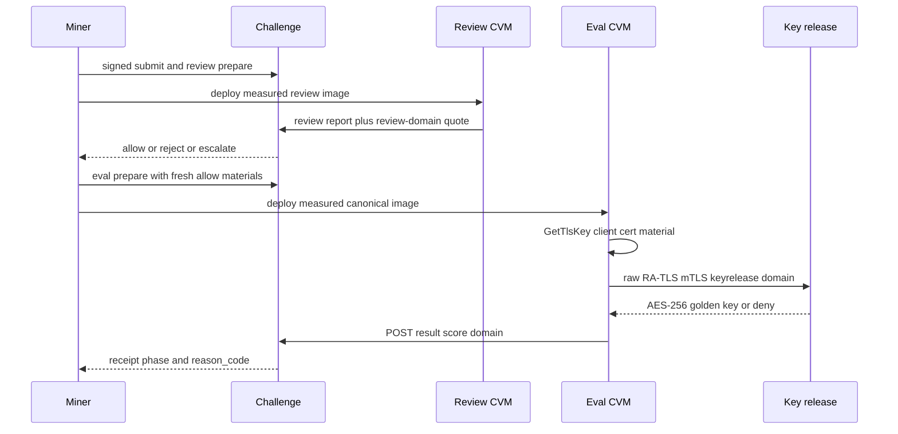

Production miner scoring for Agent Challenge runs on **Phala Cloud CPU Intel TDX** confidential VMs. The validator host may have **no** local TDX. Quotes and measurements are produced in Phala guests and re-verified by the challenge service.

Operational CLI steps: [Quickstart](/challenges/agent-challenge/quickstart) and
[self-deploy](https://github.com/BaseIntelligence/agent-challenge/blob/main/docs/miner/self-deploy.md).
Key release detail: [Key release](/challenges/agent-challenge/key-release).
Residual risk: table below and
[security](https://github.com/BaseIntelligence/agent-challenge/blob/main/docs/security.md).

## What is measured

A production app-compose plus OS image yield a canonical measurement record:

| Field | Role |
| --- | --- |
| `mrtd` | TD measurement root |
| `rtmr0` | Runtime measurement register 0 |
| `rtmr1` | Runtime measurement register 1 |
| `rtmr2` | Runtime measurement register 2 |
| `compose_hash` | Hash of the measured compose definition (dstack-compatible) |
| `os_image_hash` | Product formula identity from MRTD + RTMR1 + RTMR2 |

Product `os_image_hash`:

```text
os_image_hash = sha256(MRTD || RTMR1 || RTMR2)   # lowercase hex of decoded registers
```

`rtmr3` is treated as runtime and is excluded from the static allowlist pin used in score binding helpers; event-log replay still recovers compose identity and `key_provider` from RTMR3 events.

Miners can reproduce the six-field record with the self-deploy measurements command (challenge repo). Validators publish **dual** allowlists (review image vs canonical/eval image). A single-field mismatch is `NOT-IN-LIST`. An empty allowlist fails closed.

## Separate report_data domains

TDX quotes carry a 64-byte `report_data` field. Agent Challenge binds a **domain-separated** canonical JSON preimage so stages cannot authorize each other.

| Domain tag | Stage | Typical bound content |
| --- | --- | --- |
| `base-agent-challenge-review-v1` | Review report | Session/report digests, measurement subset, bound `issued_at` / `received_at` (≤24h on re-verify) |
| `base-agent-challenge-keyrelease-v1` | Key release | `eval_run_id`, key-release nonce, RA-TLS SPKI digest, schema_version |
| `base-agent-challenge-v1` | Score result | measurement, agent_hash, task_ids, scores_digest, eval_run_id, score_nonce |

Mixing domains is a verification failure. Guest wall clock alone never authorizes review freshness. Unattested DB phase labels (`review_allowed`) are cache only and never alone admit eval CVM or a production score.

## Review CVM vs eval CVM

| | Review CVM | Eval CVM |
| --- | --- | --- |
| Guest | CPU Intel TDX on Phala | Separate CPU Intel TDX on Phala |
| Image | Measured review compose (harness + agent ZIP under `.rules`) | Measured canonical/eval compose with baked live-task-cache |
| Secrets | OpenRouter + review session via `encrypted_env` only (**no** Base LLM gateway) | Eval capability / plan via `encrypted_env`; agent OpenRouter only when measured digests allow |
| Work | Attested LLM review (no golden tasks) | k-trial benchmark with DooD isolation; golden decrypt only after key release |
| Quote domains | review-v1 | keyrelease-v1 then score-v1 |
| Golden AES-256 key | Never | Only after successful RA-TLS release; grant is durable for the run |



## Quote verification (trust-but-audit)

Operators and auditors can re-check quotes with `dcap-qvl verify` or Phala hosted verify. Challenge acceptance is a **conjunction** of quote integrity, measurement allowlist, event log, domain binding, nonces, review freshness (bound times ≤24h on re-verify), and (for scores) durable key-grant state.

This is cryptographically-anchored trust-but-audit. It is not a claim that TEE hardware is free of class attacks.

## Residual risks

| Risk class | Design response |
| --- | --- |
| Hardware / TEE.fail-class research | Allowlist plus quote verify; auditors re-check quotes |
| Ops pin drift | Dual allowlists; single-field mismatch denies key and score |
| Provider outages (Phala, OpenRouter, DCAP) | Fail closed; no silent accepted scores |
| Ungrounded miner image | Unknown `compose_hash` fails closed |
| Domain mixup | Separate review / keyrelease / score domains |
| Replay | Single-use nonces; bound eval_run_id; fresh review re-verify |
| Key theft | RA-TLS mTLS + SPKI binding; HTTP `POST /release` disabled in production |
| Residual CVM cost | Money cap and mandatory teardown |

## Operational bounds

- CPU TDX only (`tdx.small` / `tdx.medium`). GPUs refused
- Hard projected spend cap (default **$20** for review+eval lifetime) before create
- Mandatory teardown: `phala cvms list` should show `total: 0` after cleanup
- No key-grant means no accepted score (even if a guest claimed a number)

## Related

- [Key release](/challenges/agent-challenge/key-release)
- [Evaluation](/challenges/agent-challenge/evaluation)
- [Attestation TEE (repo)](https://github.com/BaseIntelligence/agent-challenge/blob/main/docs/miner/attestation-tee.md)
