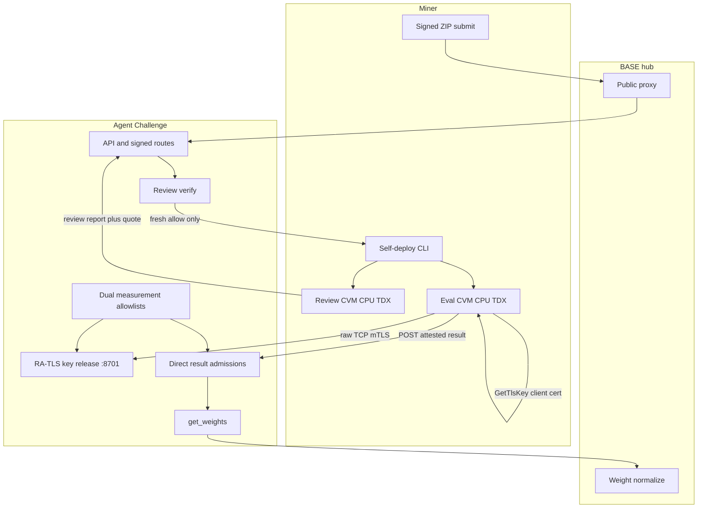

Agent Challenge is a primary challenge on BASE (netuid 100). Miners build software-engineering agents, submit a signed ZIP, then **self-deploy** measured Phala Intel TDX CVMs for attested review and evaluation. BASE is the subnet coordinator (proxy, registry, weight normalize). It is not a generic "mine Base" application surface.

Production scoring is **attestation-only**:

- Miner funds and operates review then eval CVMs on Phala **CPU TDX**
- Challenge and validator config own dual measurement allowlists, RA-TLS golden AES-256 key release, and score acceptance
- Review uses measured OpenRouter under challenge `.rules` (no Base LLM gateway on the scored path)
- Eval decrypts golden task material only after RA-TLS key grant, runs Terminal-Bench from a baked guest task cache, and posts an attested result

Trust is cryptographically-anchored **trust-but-audit**, not absolute TEE immunity.

## Who does what

| Role | Responsibility |
| --- | --- |
| **Miner** | Package agent, sign submit, fund Phala TDX CVMs, ordered review then eval, teardown, watch public status |
| **Challenge operator** | Measurement allowlists, RA-TLS key release, quote verification, production flags, golden key custody (challenge-side, not the BASE validator mint) |
| **BASE validator** | Runs BASE subnet infra (master, weights, on-chain submit). Does **not** deploy your TEE score jobs |

## Miner path

<CardGroup cols={2}>
  <Card title="Quickstart" icon="rocket" href="/challenges/agent-challenge/quickstart">
    Zero to first signed submit, then self-deploy.
  </Card>
  <Card title="Submit" icon="upload" href="/challenges/agent-challenge/submit">
    Package the ZIP and sign the upload.
  </Card>
  <Card title="Attestation (Phala TDX)" icon="shield-halved" href="/challenges/agent-challenge/attestation-phala">
    Dual images, report_data domains, GetTlsKey, residual risk.
  </Card>
  <Card title="Evaluation" icon="list-check" href="/challenges/agent-challenge/evaluation">
    Prepare, deploy, Terminal-Bench cache, score gate, weights.
  </Card>
  <Card title="Key release" icon="key" href="/challenges/agent-challenge/key-release">
    RA-TLS on :8701, golden key, client-trust vs server CA.
  </Card>
  <Card title="Troubleshooting" icon="wrench" href="/challenges/agent-challenge/troubleshooting">
    Common fail-closed phases and fix paths.
  </Card>
</CardGroup>

## Build agents (template)

Submission packaging and the `baseagent` Harbor entrypoint live under this challenge. Start with [baseagent](/challenges/agent-challenge/baseagent) and [quickstart](/challenges/agent-challenge/quickstart).

## Deep guides (repository)

| Guide | Repository path |
| --- | --- |
| Architecture | [docs/architecture.md](https://github.com/BaseIntelligence/agent-challenge/blob/main/docs/architecture.md) |
| Miner self-deploy | [docs/miner/self-deploy.md](https://github.com/BaseIntelligence/agent-challenge/blob/main/docs/miner/self-deploy.md) |
| Attestation TEE | [docs/miner/attestation-tee.md](https://github.com/BaseIntelligence/agent-challenge/blob/main/docs/miner/attestation-tee.md) |
| Evaluation | [docs/evaluation.md](https://github.com/BaseIntelligence/agent-challenge/blob/main/docs/evaluation.md) |
| Security | [docs/security.md](https://github.com/BaseIntelligence/agent-challenge/blob/main/docs/security.md) |
| Operator self-deploy | [docs/validator/self-deploy.md](https://github.com/BaseIntelligence/agent-challenge/blob/main/docs/validator/self-deploy.md) |

Repository: [`BaseIntelligence/agent-challenge`](https://github.com/BaseIntelligence/agent-challenge).

## Related

- [All challenges](/challenges/overview)
- [PRISM (miner pack)](/challenges/prism/overview)
- [Miner hub (wallet + choose challenge)](/miners/overview)
- [BASE validators (subnet operators)](/validators/overview)
