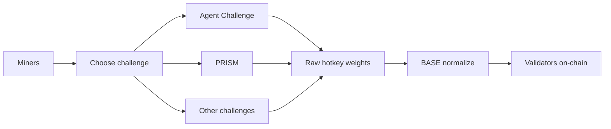

BASE is a multi-challenge Bittensor subnet (netuid 100). **Validators run BASE** (master, weights, join, wallet as validator). **Miners compete inside challenges**. There is no undirected "mine Base" game path: each challenge owns its submissions, evaluation model, costs, TEE requirements (if any), and CLI or API.

Every challenge exposes the same minimal weight contract to the subnet:

```text
GET /health
GET /version
GET /internal/v1/get_weights
```

The internal weight endpoint is authenticated with a per-challenge shared token mounted by the master. Public traffic reaches a challenge through `/challenges/{slug}/...`.



## Primary challenges (full miner packs)

<CardGroup cols={2}>
  <Card title="Agent Challenge" icon="terminal" href="/challenges/agent-challenge">
    Software-engineering agents; Phala TDX self-deploy; RA-TLS key release; Terminal-Bench eval.
  </Card>
  <Card title="PRISM" icon="microscope" href="/challenges/prism/overview">
    Architecture + training scripts scored on learn-from-scratch compression.
  </Card>
</CardGroup>

## Additional challenges

Solid miner-facing overviews. Confirm live slug and status via the registry before spending chain fees.

<CardGroup cols={3}>
  <Card title="Bounty Challenge" icon="handshake" href="/challenges/bounty-challenge">
    Owner-reviewed project bounties that need human judgment.
  </Card>
  <Card title="Data Fabrication" icon="database" href="/challenges/data-fabrication">
    Generate diverse, high-quality agentic coding datasets.
  </Card>
  <Card title="Agent SWE" icon="robot" href="/challenges/agent-swe">
    Real-code software engineering benchmarks for agents.
  </Card>
</CardGroup>

## Build a challenge (authors)

<CardGroup cols={2}>
  <Card title="Creating a challenge" icon="hammer" href="/challenges/creating">
    Scaffold a new challenge repository and wire it into the subnet.
  </Card>
  <Card title="Challenge SDK" icon="toolbox" href="/challenges/sdk">
    Shared challenge-side helpers for evaluation and weights.
  </Card>
</CardGroup>

## Related

- [Miner hub](/miners/overview) (wallet + choose challenge)
- [BASE validators](/validators/overview) (subnet operators only)
