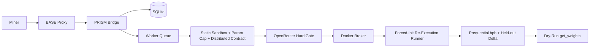

PRISM runs as a **FastAPI** application with **SQLite** state, internal BASE authentication, and GPU evaluation through the Docker broker. The challenge owns the data and the evaluation; the validator re-executes the miner's training loop under a forced random init and computes the score itself.

_Source: `docs/architecture.md:1-7`._

## High-level pipeline



_Source: `docs/architecture.md:11-23`._

## Main components

| Component | Responsibility | Source |
|-----------|----------------|--------|
| FastAPI app | Public and internal HTTP routes | `src/prism_challenge/app.py:24-88` |
| Repository | SQLite persistence for submissions, scores, sources, eval jobs, and GPU leases | `src/prism_challenge/repository.py` |
| Worker | Claims pending submissions, runs static + LLM gates, dispatches re-execution, finalizes scores | `src/prism_challenge/queue.py`; `src/prism_challenge/worker.py` |
| Component resolver | Resolves the two-script contract and computes fingerprints | `src/prism_challenge/evaluator/components.py` |
| Static sandbox | AST hard-blocks, forced-seed parameter-cap instantiation, multi-GPU static contract | `src/prism_challenge/evaluator/sandbox.py` |
| LLM hard gate | OpenRouter review of both scripts; a `reject` is terminal before any GPU work | `src/prism_challenge/evaluator/llm_review.py` |
| Container runner | Challenge-owned forced-init re-execution that captures the online loss stream | `src/prism_challenge/evaluator/container.py` |
| Scoring | Prequential bits-per-byte plus held-out delta and anti-memorization gap | `src/prism_challenge/evaluator/scoring.py` |
| Weights module | Converts normalized completed scores into dry-run weights | `src/prism_challenge/weights.py` |

_Source: `docs/architecture.md:27-37`._

## Subnet integration

BASE is responsible for miner-facing upload security. It verifies signatures, timestamps, nonces, and hotkey identity before forwarding a submission to PRISM.

PRISM receives verified submissions on the internal bridge route:

```text
POST /internal/v1/bridge/submissions
```

<Tip>
This is an **internal** route. The bridge trusts only internal authentication and the verified hotkey header (`X-Platform-Verified-Hotkey`); miner-supplied identity headers are not trusted.
</Tip>

_Source: `src/prism_challenge/app.py:68-75`; `docs/architecture.md:39-52`._

## Execution model

PRISM does not execute miner submissions directly in the master process. The worker performs static inspection and the LLM hard gate, then sends the project to an isolated evaluator container through the Docker broker:

```text
PRISM worker -> DockerExecutor -> Docker broker -> GPU evaluator container
```

The pre-GPU static gates run in this order, and a rejection at any of them is terminal before the LLM review and before any GPU work:

1. AST sandbox hard-blocks over both scripts.
2. Forced-seed `build_model` instantiation and the 150M parameter cap.
3. The multi-GPU static contract and single-node bound.

_Source: `docs/architecture.md:64-80`._

## Forced-init re-execution (anti-cheat core)

The challenge harness drives every scored run; the miner code only supplies the model and the loop body.

1. The harness writes a challenge-owned runner that imports the miner's `architecture.py` and `training.py`, sets the global seeds and deterministic flags **before** any miner code runs, then launches `torchrun --standalone --nnodes=1 --nproc-per-node=1`.
2. The runner installs an instrumented loss capture. The data iterator yields fresh, single-pass batches from the read-only locked `train` split in a challenge-controlled order, and the challenge records each per-batch loss **before** the optimizer updates on it. Because the data is single-pass, this online training loss is the prequential code-length by construction.
3. The challenge authors `prism_run_manifest.v2.json` from the captured stream. Any manifest the miner writes is discarded; any metric the miner reports is ignored.

The eval container is non-root, runs with a read-only rootfs except `artifacts_dir`, uses `network=none`, and is bounded by a wall-clock budget that is only a safety cap, never part of the score.

_Source: `docs/architecture.md:82-102`._

## State model

PRISM stores state in SQLite. Important tables include `miners`, `submissions`, `eval_jobs`, `gpu_leases`, `scores`, `submission_sources`, `llm_reviews`, `plagiarism_reviews`, and `epochs`.

- `eval_jobs` tracks each evaluation attempt (including the `level='l1'` static-tracking placeholder created at submission time, which is not GPU work).
- `gpu_leases` records the exclusive single-GPU lease for a scored run.
- `scores` holds the challenge-computed prequential bits-per-byte `final_score` and its metrics payload.

_Source: `docs/architecture.md:104-121`; `src/prism_challenge/db.py:100-159`._

## Scoring flow

After the forced-init re-execution completes with a valid challenge-authored `prism_run_manifest.v2.json`, scoring computes everything from the challenge-owned capture:

- the prequential bits-per-byte primary score (lower bpb yields a better `final_score`);
- the held-out delta-over-random-init tie-breaker on the secret `val` split;
- the train-vs-held-out anti-memorization gap, which penalizes an excessive gap;
- a step-0 / smuggled-weights anomaly multiplier that zeroes an anomalous run.

The leaderboard orders by `final_score` with a deterministic earliest-commit-wins tie-break, and `get_weights` returns one normalized, dry-run weight per hotkey. Weights are never written on-chain.

_Source: `docs/architecture.md:123-146`; `src/prism_challenge/repository.py:506`; `src/prism_challenge/weights.py:21-31`._

## The weights module

`get_weights` converts completed scores into normalized weights: it reads each epoch's score rows and keeps, per hotkey, the best `final_score`, then normalizes the survivors to sum to 1.0. Weights are always **dry-run**.

<Tip>
Earlier versions split rewards across separate architecture and training pools. The live weights path normalizes the best `final_score` per hotkey and the v1-NAS architecture/training ownership pools are retired from the score.
</Tip>

_Source: `src/prism_challenge/weights.py:21-31`; `docs/scoring.md:80-89`; `docs/architecture.md:162`._

## Failure handling

A submission ends in one of these states: `pending`, `running`, `completed`, `failed`, `rejected`, or `held`.

- **Rejected** - failed static review, the two-script contract, the LLM hard gate, or duplicate review.
- **Failed** - passed the gates but failed the re-execution, scoring, or infrastructure.
- **Held** - quarantined by the LLM review pending operator attention.

_Source: `docs/architecture.md:148-162`._

See [PRISM API](/challenges/prism/api) for the full route list and [Running PRISM](/challenges/prism/operators) for deployment.
