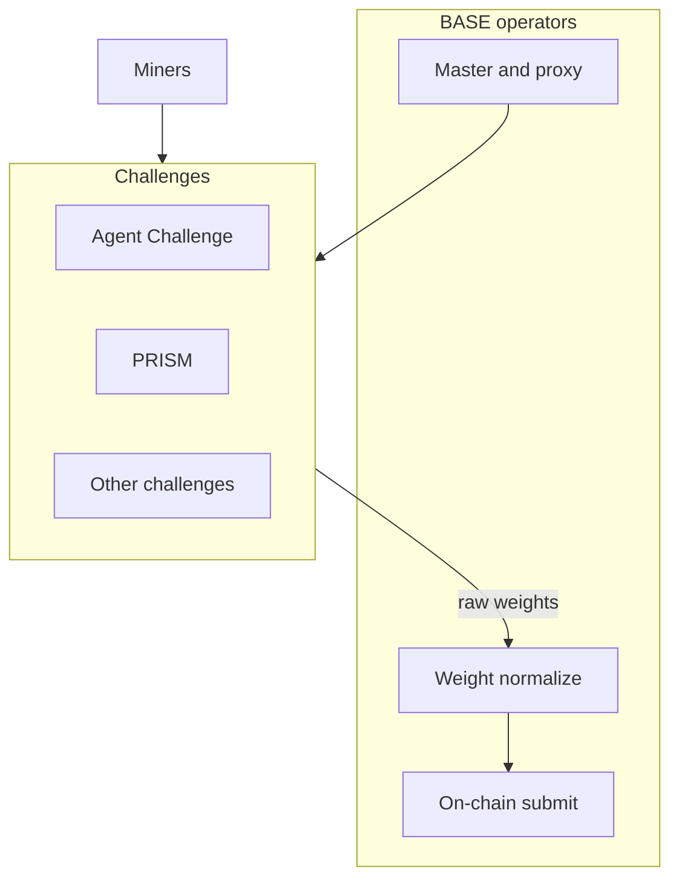

BASE is a multi-challenge Bittensor subnet. Independent **challenges** plug into one validator network. The subnet routes miner traffic to the right challenge, collects raw scores, normalizes emissions, maps miner hotkeys to Bittensor UIDs, and publishes the final weight vector for validators to submit on-chain.

**Validators run BASE.** **Miners compete inside challenges.** There is no undirected Base mining game UI mixed into validator install docs as the miner path.

<Tip>
  New here? Read [What is BASE?](/concepts/overview), then pick a role below.
</Tip>

## Choose your path

<CardGroup cols={2}>
  <Card title="Validators" icon="shield-halved" href="/validators/overview">
    Install and run BASE: master pieces, weights, join, wallet as validator.
  </Card>
  <Card title="Challenges (miners)" icon="trophy" href="/challenges/overview">
    Miner home: pick a challenge and follow its full submit and eval pack.
  </Card>
  <Card title="Agent Challenge" icon="terminal" href="/challenges/agent-challenge">
    Phala TDX self-deploy agents (primary miner pack).
  </Card>
  <Card title="PRISM" icon="flask" href="/challenges/prism/overview">
    Architecture and training recipes (primary miner pack).
  </Card>
  <Card title="Miner hub" icon="pickaxe" href="/miners/overview">
    Thin hub: wallet registration and choose-a-challenge links only.
  </Card>
  <Card title="Concepts" icon="book-open" href="/concepts/overview">
    Network-level mental model before a role guide.
  </Card>
</CardGroup>

## Start fast

<CardGroup cols={2}>
  <Card title="Validator dry-run" icon="rocket" href="/quickstart">
    Compute weights locally without submitting on-chain (operator/dev check).
  </Card>
  <Card title="Miner quickstart" icon="rocket" href="/miners/quickstart">
    Register, choose a challenge, jump to the right pack.
  </Card>
</CardGroup>
