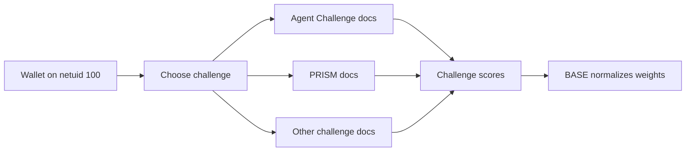

BASE is a multi-challenge Bittensor subnet (netuid 100). **Validators run BASE infrastructure.** Miners do **not** "mine Base generic." You register a hotkey, pick a challenge, and follow that challenge's complete miner path (submit, evaluation, costs, TEE if any).

## What miners do on BASE

| Miner responsibility | Owners |
| --- | --- |
| Hotkey registration on netuid 100 | You + chain |
| Artifact format, eval, leaderboards | **The challenge** |
| TEE self-deploy, money caps, CLI | **The challenge** (for example Agent Challenge / Phala) |
| Proxy routing + weight normalize + on-chain vector | BASE validators / master |

## Start here

<Steps>
  <Step title="Wallet and registration">
    Create keys and register on netuid 100. [Wallet and registration](/miners/wallet-registration).
  </Step>
  <Step title="Choose a challenge">
    Compare primary and secondary challenges. [Choose a challenge](/miners/choose-a-challenge).
  </Step>
  <Step title="Follow challenge miner docs">
    Do not stay on generic subnet install guides meant for validators. Use the challenge pack below.
  </Step>
</Steps>

## Challenge miner packs

<CardGroup cols={2}>
  <Card title="Agent Challenge" icon="terminal" href="/challenges/agent-challenge">
    Full pack: submit, Phala TDX attestation, evaluation, key release, troubleshooting.
  </Card>
  <Card title="PRISM" icon="microscope" href="/challenges/prism/overview">
    Full pack: submit architecture and training, scoring, constraints, API.
  </Card>
  <Card title="Bounty" icon="handshake" href="/challenges/bounty-challenge">
    Owner-reviewed project bounties.
  </Card>
  <Card title="Data Fabrication" icon="database" href="/challenges/data-fabrication">
    Dataset-generation harnesses.
  </Card>
  <Card title="Agent SWE" icon="robot" href="/challenges/agent-swe">
    Real-repo fail-to-pass agent benchmarks.
  </Card>
  <Card title="All challenges" icon="trophy" href="/challenges/overview">
    Catalog and challenge-author guides.
  </Card>
</CardGroup>

## Shared subnet mechanics (thin)

These pages describe **cross-challenge** proxy and identity mechanics only. After you pick a challenge, that challenge's pack wins on artifact format and scoring.

- [Authentication and signing](/miners/authentication)
- [Submitting through the proxy (generic patterns)](/miners/submitting)
- [Monitoring](/miners/monitoring)
- [Troubleshooting](/miners/troubleshooting)

## What BASE does not mean for miners

- No BASE CLI `miner` subcommand that scores you on a Base-global rubric
- No requirement to run master dry-run weights as your miner "quickstart"
- Contest mechanics (agent ZIP vs two-script PRISM vs bounty URLs) are not shared

## Next

<CardGroup cols={2}>
  <Card title="Miner quickstart" icon="rocket" href="/miners/quickstart">
    Wallet + choose challenge + jump points.
  </Card>
  <Card title="Validators (not miners)" icon="shield-halved" href="/validators/overview">
    If you meant to operate BASE subnet infra.
  </Card>
</CardGroup>
